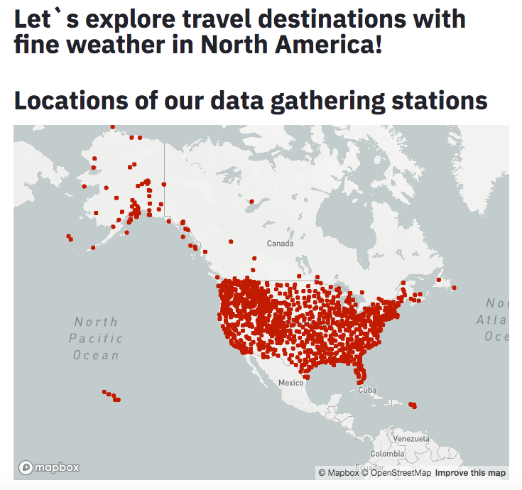

# North America Travel Guide!

We aim to help users find travel destinations with fine weather in North America! This is achieved through interactive data visualizations and input based recommendations.

## Project Goals
Our goal is to help users find travel destinations with fine weather in North America. We are able to help users regardless of whether they know when and where to travel.

## Design
Visualization 1: Map of data gathering stations.
We designed this map so that users can see where our data is coming from. It also gives them an overall idea about the possible places that we would recommmend to them for traveling. 

Visualization 2: Average measurements for each state given months.
We designed this visualization for users who already have a general idea of where they want to travel to. They could look up the different statistics (temperature, precipitation, wind speed, etc) for their destination. Moreover, they could select different time ranges and compare the statistics to decide when to travel. We originally considered providing 1 month selections instead of range of months, but we decided that users in this category may have friends or relatives at the destination, and hence would need to stay longer.

Visualization 3: Average measurements for each month.
We designed this visualization to help users with undecided travel dates. They could explore this tool to find out when would be the best time travel and can plan their vacation accordingly.

Visualization 4: Average measurements for different elevations.
We designed this visualization to assist hikers! Exploring this tool allows hikers to decide what range of elevations suits them best.

Visualization 5: Recommend 10 states to travel to given user input.
By now if the user is still unsure where to travel to, we will provide them with recommendations! By telling us the month of their travel and their preferred temperature and precipitation level, we will find the 10 closest states that match their preference during that month, and plot them on the graph to show their temperature and precipitation levels. For this visualization, we originally considered plotting all states on the graph and let the users decide wich one they want to travel to. That became too messy with color coding or with text labeling. Thus, we decided to implement a function that finds the nearest neighbours to the user`s preference, and plot only the top 10.

## Development
We came up with the choice of dataset and question together. Xinyi Xu focuesed on Visualization 2-4, and Ruoxin Huang focused on Visualization 1 and 5. We roughly each spent 15 hours, totaling 30 hours. The process of planning what question to answer and which visualization to use took about 10 hours. Once that was set, we spent some time to famaliarize ourselves and started implementing. Althought we had to redesign some of our visualizations, implementing generally went smooth. Overall, planning took the most time.
